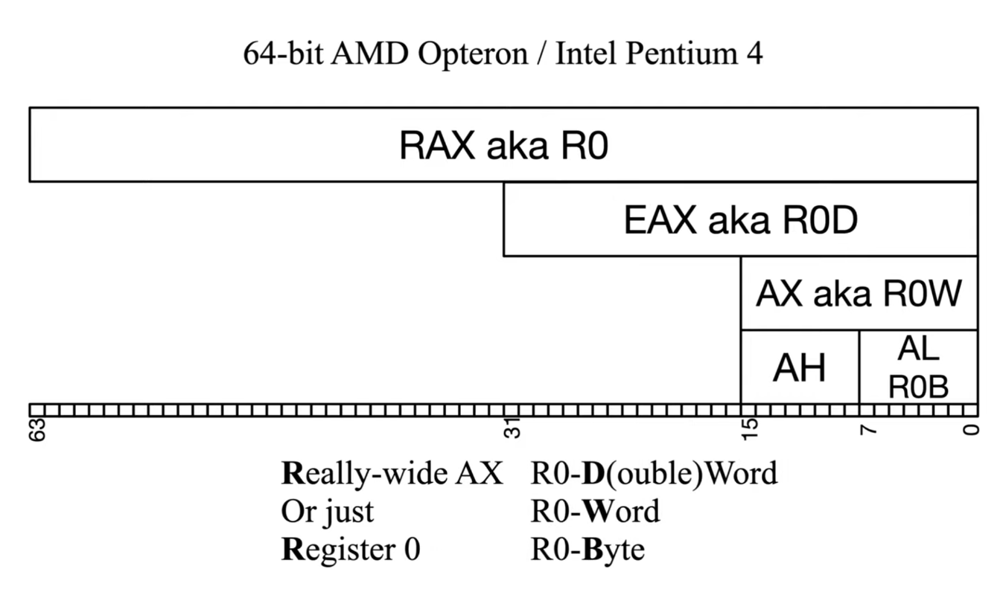
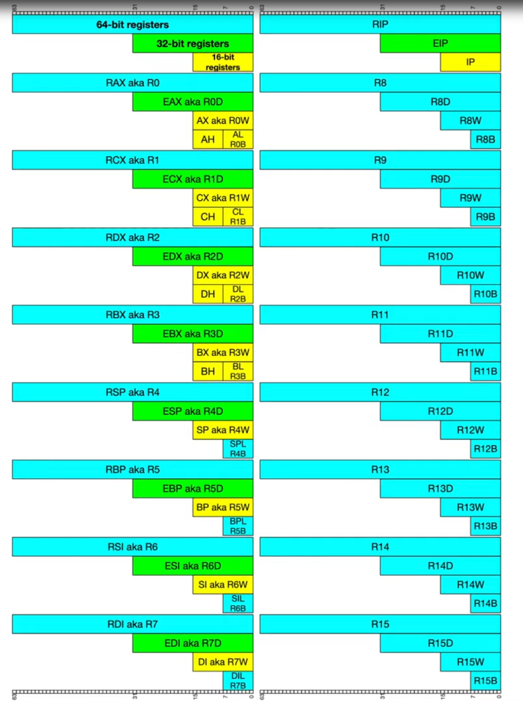

also called x86-64
# registers
- 16 general purpose registers + instruction pointer.
	- x86-32 - 32bit/4byte wide
	- x86-64 - 64bit/8byte wide
## naming convention


## rflags
eflags extended to 64 bits, but the extended space is not used.
- status flags
	- zero flag (6) - set if the result of some instruction is zero
	- sign flag (7) - set equal to the most significant bit of the result which is the sign. 1=neg 0=pos
## c data type size
```nasm
char -> 1 byte
short -> 2 bytes -> word
int/long -> 4 bytes -> double word
double/long long -> 8 bytes -> quad word
```
## usage convention (intel)
intel's suggestion of usage of registers:
- rax - return value of functions (a=accumulator)
- rbx - base pointer to data section (b=base)
- rcx - can be used for loops (c=counter)
- rdx - i/o pointer (d=data)
- rsi - points to string for string operation (si=string index)
- rdi - points to string for string operation (di=destination index)
- rsp - stack pointer: points to top of the stack
- rbp - base pointer: maintains base of a function's stack frame
- rip - instruction pointer - points to next instruction

## reading manual
- `r/mX`
```nasm
; operand has form `r/mX` which means you can specify register or memory, of size x bits 
; r/m16
; r/m32
; r/m64

; operand can be specified in 4 forms:
rax ; -> value in rax
[rax] ; -> dererence address in rax, and get the value
[rax + rcs * x] 
[rax + rcs * x + Y]

; memory descriptors are used to indicate the size of data being operated on
mov qword ptr [rsp], rax
```
- `immX`
```nasm
; operand can specify immediate values of x bit
; imm64
; imm32
; imm16
0x1234
```
## syntax
```nasm
; intel
; destination <- source
add rax, 0x20

; at&t
; source -> destination
add $0x20, %rax
```
# instructions

## nop
```nasm
; no operation.
; does nothing.
; is an alias for `xchg eax, eax` which also does nothing.
; opcode - 0x90, but can also be multi byte.
nop
```
## push
```nasm
push operand
; push quadword (8 byte) to stack.
; stack pointer decrements by 8

; operaand can be r/m16 r/m32 r/m64
push rax
push [rax]
push [rax + rcx * x] ; x = 1 2 4 8

; operand can be imm8 imm16 imm32
push 0xdeadbeef
```
## pop
```nasm
pop operand
; increments rsp by 8

; operand can be r/mX
pop rax
pop [rax]
```
## call
```nasm
; transfer and resume control
; pushes the next address on stack and jump to `operand`
; destination address can be:
	; absolute address
	; relative address
call 0xdeadbeef
```
## ret
```nasm
; return from prodecure
ret ; pop the top of the stack to rip
ret 0x20 ; pop the top of the stack to rip and add 0x20 bytes to rsp
```
## mov
```nasm
; register <-> register
mov rax, rbx

; memory <-> register
mov rax, [rbx]
mov rax, [rbx + rcx * 12]
mov [rbx], rax
mov [rbx + rcx * 12], rax

; memory <- immediate | only supports imm32
mov [rbx + rcx * 12], 0xdeadbeef 

; register <- immediate
mov rax, 0xdeadbeef

; does not move memory to memory
; mov can only move imm32 to memory.  
```
## add & sub
```nasm
; adds or substracts value
; destination can be `r/mX`
; source can be `r/mX` or `immX`
; except memory to memory
add rax, 0x10
sub rax, [rbx + rcx * 12]
```
## multiplication
```nasm
; imul
; signed multiply

; three forms
; one operand
imul r/m8 ; ax = al * r/m8
imul r/m16 ; dx:ax = ax * r/m16
imul r/m32 ; edx:eax = eax * r/m32
imul r/m64 ; rdx:rax = rax * r/m64

; two operand
; truncation is possible
; r16 = r16 * r/m16
; r32 = r32 * r/m32
; r64 = r64 * r/m64
imul reg, r/mX

; three operand
imul reg, r/mX, imm
; r16 = r/m16 * (8-bit immediate sign-extended to 16 bits)
; r32 = r/m32 * (8-bit immediate sign-extended to 32 bits)
; r64 = r/m64 * (8-bit immediate sign-extended to 64 bits)
; r16 = r/m16 * 16-bit immediate
; r32 = r/m32 * 32-bit immediate
: r64 = r/m64 * (32-bit immediate sign-extended to 64 bits)
```
## division
```nasm
; div
; unsigned divide

; divide ax by r/m8 | al -> quotient | ah -> remainder
div cl ; disassemblers might specify as div ax, cx

; divide dx:ax by r/m16 | ax -> quotient | dx -> remainder
div cx ; disassemblers might specify as div ax, cx

; divide edx:eax by r/m32 | eax -> quotient | edx -> remainder
div ecx ; disassemblers might specify as div eax, ecx

; deivide rdx:rax by r/m64 | rax -> quotient | rdx -> remainder
div rcx ; disassemblers might specify as div rax, rcx


; idiv
; signed divide, same form as div
```
## movzx
```nasm
; move with zero extend.
; usefull for moving small values to large values, treating values as unsinged
; fills high order bits with zero
mov eax, 0xf00dface
movzx rbx, eax ; rbx = 0x00000000f00dface
```
## movsx
```nasm
; move with sign extend.
; use for moving small values to large values, treading values as signed.
; eg; moving 4 bytes -1 to 8 bytes -1 preserving signness.
; sign extends only 8 or 16 bit values (byte or word)
```
## movsxd
```nasm
; move 32 bit signed value (double word) to 64 bit (quadword) value
mov eax, 0xf00dface
movsxd rbx, eax ; rbx = 0xfffffffff00dface
```
## lea
```nasm
; load effective address
; used for pointer arithmetic
; the only instruction where `[]` does not mean dereference
lea rax, [rdx + rbx * 8 + 5]
; calculate value inside the square bracket and stored value in rax without dereferencing
```
## jmp
```nasm
; unconditional jump
; change rip to given location
; short/relative jump
jmp displacement ; rip = rip of next instruction + 1 byte sign extend to 64 bits displacement
jmp address ; is just encoded as jmp n bytes forward for example
```
## cmp
```nasm
; comparison instruction
; the second operand is subtracted from the first operand and status flag is set accordingly
; different from subtract because the result is not stored anywhere, unlike sub
```
## jcc
```nasm
; conditional jump

jz/je ; zf=1
jnz/jne ; zf=0
jle/jng ; zf=1 or sf!=of
jge/jnl ; sf=of
jbe/jna ; cf=1 or zf=1
jb ; cf=1
js ; sf=1
jns ; sf=0

; a = above | unsigned notion | 0xff is above 0x00
; b = below | unsigned notion | 0x00 is below 0xff
; g = greater | signed notion | 0x00 is greater than 0xff
; l = less | singed notion | 0xff is less than 0x00
; e = equal | same as zero flag set
; n = not

cmp dword ptr [rsp+4], eax
; jump if value at [rsp+4] is not equal to eax
jne 0xdeadbeef
; jump if value at [rsp+4] is less than or equal to signed value in eax
jle 0xdeadbeef
; jump if value at [rsp+4] is greater than or equal to unsigned value in eax
jge 0xdeadbeef
```
## boolean instructions
```nasm
; all boolean instructions set the status flag accordingly

; bitwise and
and al, bl
and al, 0x42

; bitwise or
or al, bl
or al, 0x42

; xor - exclusive or
xor eax, ebx
xor eax, eax ; zero out a register

; not
not rax
```
## inc/dec
```nasm
; operand can be r/mX
; increase or decrease value by 1
; modifies status flag
inc rax
dec rbx
```
## test
```nasm
; calcualte bitwise and, sets the status flags and discard the result.
; similar to cmp but for and operation.
text eax, ebx

; usually used to check if register is zero
; jump to 0xdeadbeef if eax is zero
test eax, eax
jz 0xdeadbeef 
```
## shift instructions
```nasm
; shl
; shift left (<< in C)
; first operand -> r/mX
; second operand cl | imm8
; sets carry flag if bits go beyond the size
; another of multiplying with power of 2
shl bl, 2 ; multiply bl with 2^2
shl bl, 4 ; multiply bl with 2^4

; shr
; shift right (>> in C)
; first operand -> r/mX
; second operand cl | imm8
; sets carry flag if bits go beyond the size
; another of dividing with power of 2
shr bl, 2 ; dividing by 2^2
shr bl, 4 ; dividing by 2^4

; sar
; shift arithmetic right for signed values
; fills the new shifted bits with whatever the MSb is 
; first operand -> r/mX
; second operand cl | imm8
; bl = 10110011
sar bl, 2
; bl = 11101100

; sal
; shift arithmetic left
; same as shl
sal bl, 2

```
## rep instructions
```nasm
; all rep instruction uses *cx as a counter

; rep stos
; repeat store string
; fills 1/2/4/8 bytes at [rdi] with al/ax/eax/rax rcx times

; rep movs
; repeat move string; assembly equivalent of memcpy
; copies 1/2/4/8 at a time from [*si] to [*di]
rep movs dword ptr [rdi], dword ptr [rsi]
; the direction flag specifies the direction in which copy occurs
; based on the direction, ri and di increments or decrements
```
# register convention
## caller save register
- register belongs to the callee
- caller must save the register, assuming it will be changed by the callee.
```nasm
; visual studio
rax, rcx, rdx, r8, r9, r10, r11

; gcc
rax, rdi, rsi, rdx, rcx, r8, r9, r10, r11
```
## callee save register
- register belongs to the caller. 
- hence, callee must save those register and restore them before returning.
```nasm
; visual studio
rbx, rbp, rdi, rsi, r12, r13, r14, r15

; gcc
rbx, rbp, r12, r13, r14, r15
```

# calling conventions
- compilers use a subset of caller save registers for passing arguments in and out of the function.
-  rax is used to return values from function given the value is 64 bytes or less.
## ms x64 abi
```C
int function(
	int a, // rcx
	int b, // rdx
	int c, // r8
	int d, // r9
	int e, // pushed on stack
	int f // pushed on stack
) { .. }
```
- in most cases, ms abi does not use frame pointer. no ebp register to maintain base of stack frame.
- if space is dynamically allocated using `_alloca()`, then frame pointers is used to mark base of the stack frame.
- ms document doesn't say that it has to be `ebp`
### ms shadow store
- ms uses 4 register fall call calling convention by default.
- the caller must allocate space to accommodate 4 function parameter. this is called shadow store.
- parameter beyond the first 4, should be pushed on the stack before calling the function. the first four is then passed through 4 registers. the callee, can use the space on the shadow store to save the first four register.
- this is the reason by why a simple function with no variable, by default reserves a space for 0x28 bytes (16 byte padding for return alignment and 4 8 byte chunk of shadow store) 
- eg for 6 parameters passed
	- caller allocated shadow store for 4 parameters
	- caller places the last two parameters on the stack
	- callee passes first 4 parameter over registers
	- callee moves value from these 4 register to shadow store
## system V x86-64 abi
```C
int function(
	int a, // rdi
	int b, // rsi
	int c, // rdx
	int d, // rcx
	int e, // r8
	int f, // r9
	int g, // stack
	int h, // stack
) { .. }
```
- frame pointers are used to mark the base of the stack frame using `rbp` register. can be disabled.
```nasm
push rbp
mov rbp, rsp
...
...
pop rbp
ret
```
## 32-bit calling convention
- cdecl
	- default in most c code
	- caller cleans up the stack
- stdcall
	- used in wind32 apis
	- callee cleans up the stack
- function parameters are pushed on the stack from right to left.
- both these calling convention uses something called stack frame pointer.
- this uses ebp register to maintain a stack base pointer
# writing assembly
## inline assembly
### gcc
inline assembly is supported in gcc using the gas syntax
### visual studio
inline assembly was supported in x32 but not anymore in x64. but a some instructin can be used in c code using visual studio instrinsics.
```C
// they look like function calls but compiler translate them to literal assembly instructions
// fuctions like __stosX 
```
## standalone assembly
# GCC
### AS
- GNU assembler, integrates with gcc, ld etc.
- uses at&t syntax by default
```nasm
.intel_syntax noprefix
.global _start ; tells linked where to find start execution

_start: _start is a label program execute from here
mov rax, 60
mov rdi, 42
syscall
```
- can be compiled with `as` and linked with `ld`
```bash
as code.s -o code.o
ld asm.o -o code
./code
```
all of this can be simply done directly by gcc
```bash
gcc -nostdlib code.s -o code
./code
```
### MASM
microsoft assembler, used with visual studio
```masm
PUBLIC asm_function

.code 
asm_function PROC
	mov rax, 1
	ret
asm_function ENDP
end
```
- NASM - netwide assembler - cross platform

 